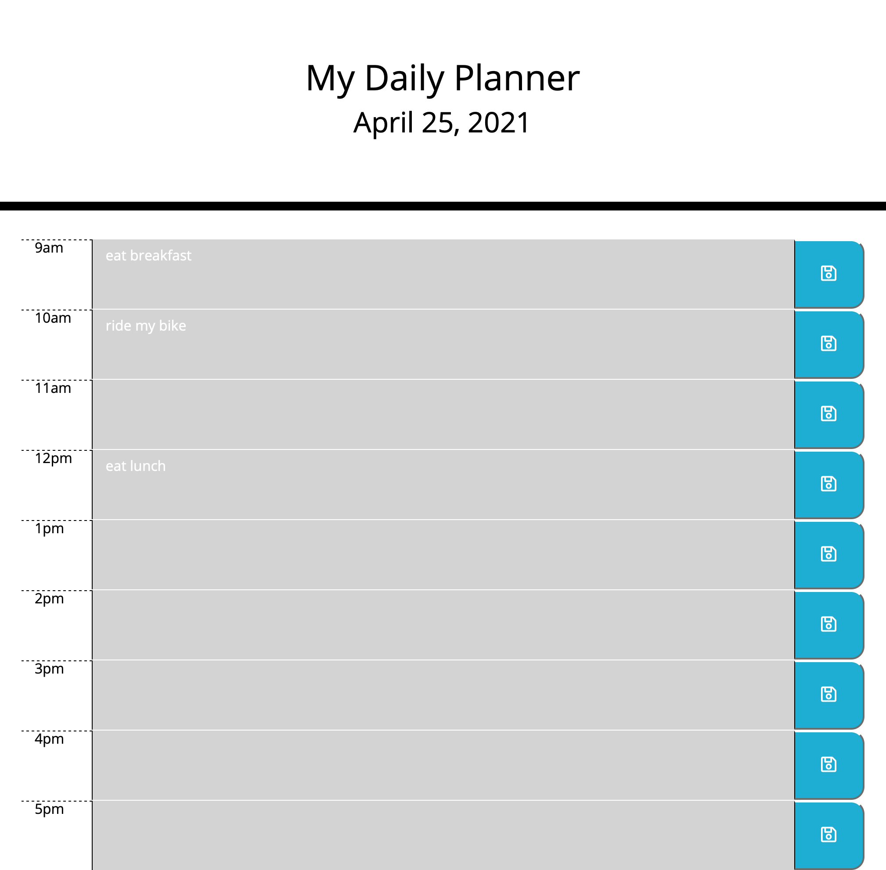

# Daily Planner

## Description

The following assignment was to create a daily planner for someone with a busy schedule that can add things to time slots throughout the day and save and retrieve their schedule. This assignment included a mix of HTML, CSS, Javascript, Jquery, bootstrap and moment.js. The HTML and CSS were given, however I had to create the time blocks using bootstrap, with rows and columns. Once the time blocks were created the next step was to utilize the given classes of "past" "present" and "future". I created a for loop to run through each time block and compared it to real time. Depending what time it is, the time block color will change accordinly. Then, I created a function so when the save button is clicked, the information in the time block is saved to local storage and does not disappear when the page is refreshed.

## Credit:

Hannah Folk, my tutor, helped with reviewing my code. I also utilized youtube to help me.

## Deployed Site:

https://eweagraff.github.io/daily_planner/

## License:

Copyright 2021 Emily Weagraff

Permission is hereby granted, free of charge, to any person obtaining a copy of this software and associated documentation files (the "Software"), to deal in the Software without restriction, including without limitation the rights to use, copy, modify, merge, publish, distribute, sublicense, and/or sell copies of the Software, and to permit persons to whom the Software is furnished to do so, subject to the following conditions:

The above copyright notice and this permission notice shall be included in all copies or substantial portions of the Software.

THE SOFTWARE IS PROVIDED "AS IS", WITHOUT WARRANTY OF ANY KIND, EXPRESS OR IMPLIED, INCLUDING BUT NOT LIMITED TO THE WARRANTIES OF MERCHANTABILITY, FITNESS FOR A PARTICULAR PURPOSE AND NONINFRINGEMENT. IN NO EVENT SHALL THE AUTHORS OR COPYRIGHT HOLDERS BE LIABLE FOR ANY CLAIM, DAMAGES OR OTHER LIABILITY, WHETHER IN AN ACTION OF CONTRACT, TORT OR OTHERWISE, ARISING FROM, OUT OF OR IN CONNECTION WITH THE SOFTWARE OR THE USE OR OTHER DEALINGS IN THE SOFTWARE.
